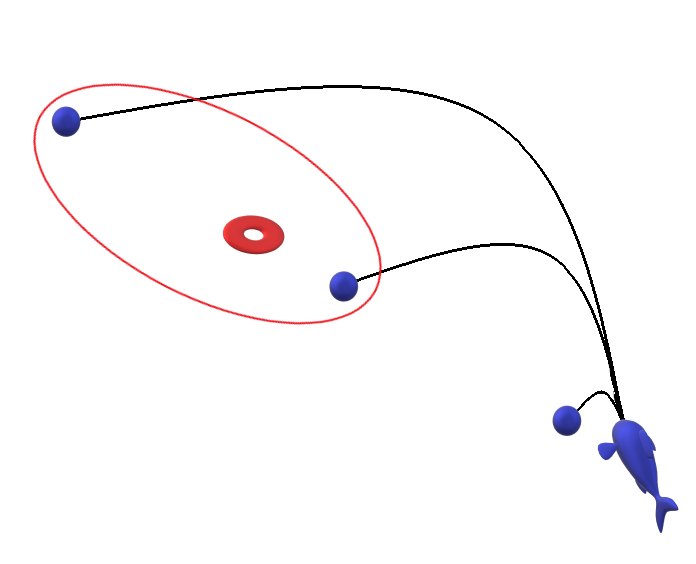
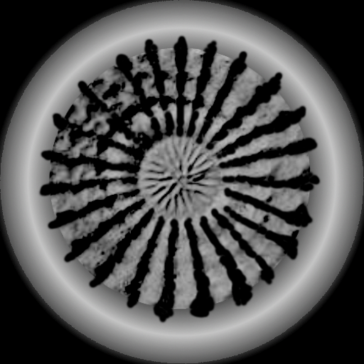

# CGRA 2020/2021

## Group T07G09
| Name             | Number    | E-Mail             |
| ---------------- | --------- | ------------------ |
| Bruno Mendes     | 201906166 | up201906166@fe.up.pt |
| Francisco Colino | 201905405 | up201905405@fe.up.pt |

---

## Extra-features and details

### 1 - Rock pickup and throw

This extra feature was created as an evolution of the point 6.3 and extra feature 7.4 from the Project part B.
This feature can be devided in 4 parts:
 - Pickup - where the fish inclines and rotates, in an incremental animation, so that it's facing the rock and the fish pickups the rock into his mouth
 - Aiming - the fish rotates so that its mouth is directly facing the nest and inclines 45º upwards, in an incremental animation
 - Speed calculation - the program computes the necessary speed that the fish must apply to its throw so that the rock always lands on the nest through a parabolic trajectory
 - Throw - the fish applies the necessary speed calculated before and throws the rock in the direction of the nest, then proceeds to rotate and incline back to the state it had before beggining the aiming

This feature turned out to be very smooth with the animations and even pleasing to watch the rock being thrown and always hitting the target.

The rock can be thrown from anywhere on the map and it is sure to always hit the target.

A bit more detailed explanation of the steps with gifs of the full process:

#### 1.1 - Pickup

#### 1.2 - Aiming

#### 1.3 - Speed calculation

The program computes a possible velocity that the can be thrown with to hit the nest.
The aim is not center of the nest but rather the nest with its radius, the computation was made in a way that the rock always hits the nest but depending where its thrown from, it lands on a different place inside the nest, the method is deterministic, if 2 or more rocks are thrown from the same place they will all land on the same place. By doing things this way the throw feels more natural and realistic as a fish might be able to always hit target but not the same place.

This being said, what detects if the rock will hit target is if the landing spot of the rock thrown with the computed x velocity is within the nest position + radius, if the raidus is extremely small the rocks will land all in the "same" spot (they will have slight variations but these will be unnoticeable to the human eye).

How it works:

First three different speeds are used:

 - v1: very low (0.0)
 - v2: inbetween v1 and v3 (10.0)
 - v3: very high (20.0)

Which will cause the rocks to fall in a pattern similar to this:

 - Blue spheres: simulated rocks with v3, v2, v1 (from left to right)
 - Red circle: fish nest

As we can see there is one rock that went past the nest (rock thrown with v3), one that is closer to the fish than it is to the nest (rock thrown with v1) and one inbetween (rock thrown with v1).

The algorithm chooses two rocks one that is past the nest and one that didn't, if there are two rocks that meet either of these conditions 
simultaneously (in this case v1 and v2) the one closest to the nest is chosen.

Once we have these two rocks a new velocity that is calculated by the median of the selected velocities replaces v2. Which causes a new rock projection.

This process repeats itself until a rock lands inside the nest.

#### 1.4 - Throw

### 2 - Pillars with shaders

Even though the pillars had a nice feel to it they felt a little plain so a shader was applied to them. This shader was made by 2 parts:
 - Gourad shading
 - Bump map

Here we have the bump map:

And the texture used for the pillar:

As it can be seen the parts that have seaweed on the texture are the parts that are highlited with a bright green in the bump map, this green is used as a positive offset in the pillar, (green parts are more outwards), the red parts are used as negative offsets (red parts are more inwards) and the black parts are neutral (nothing changes, dimensions are the same on those points). Which leads to the following result:

### 3 - Fishnest height map

For the fish nest, instead of using a shell, a model closer to reality was used.

The model for the fish nest was based of a real life fish nest from a puffer fish, here we have the base image:

This image went several transformations, using a photo editing program, such as: 
 - Conversion to black and white
 - Cropping and selection of only the center
 - A bit of hand painting
 - Addition of an outer ring made with gradients so that the color goes high and then back down a bit

The brighter parts are used to map higher parts on the model, which gives it this final look:

## Screenshots

### 1 - Fish

### 2 - Sea Floor

### 3 - Water Surface

### 4 - Rocks

### 5 - Pillars

### 6 - Complete scene without additional features

### 7 - Rock pickup and throw

### 8 - Additional features

