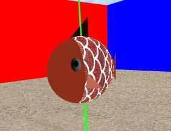
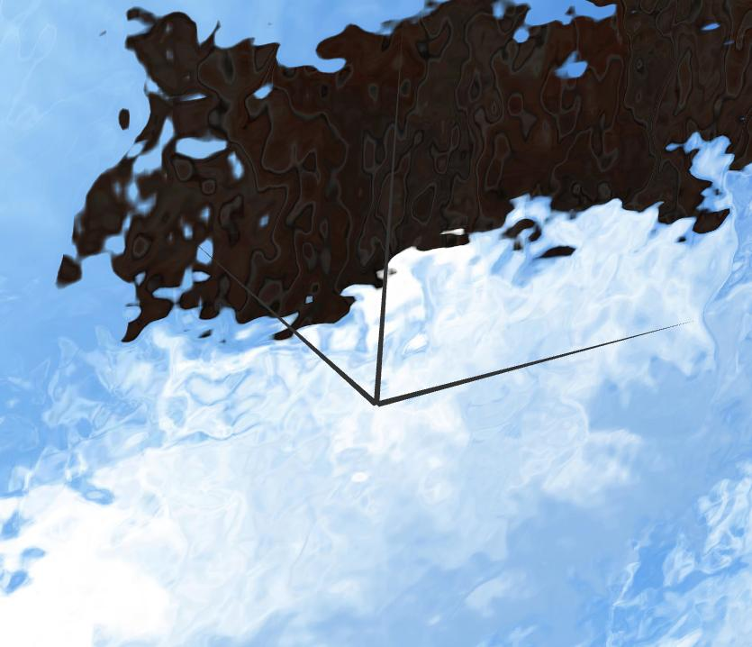
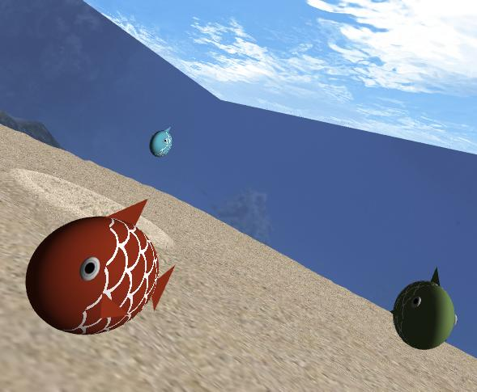

# CGRA 2020/2021

## Group T7G09

## Screenshots

### 1 - Fish

### 2 - Sea Floor

### 3 - Water Surface

### 4 - Rocks

### 5 - Pillars

### 6 - Complete scene without additional features

### 7 - Rock pickup and throw

### 8 - Additional features

